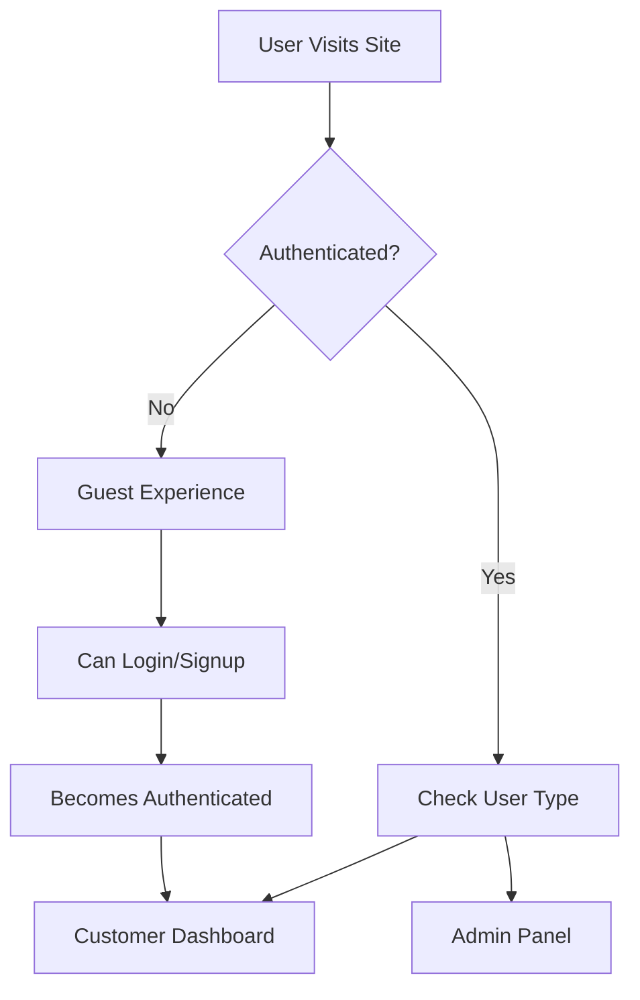

# 🛍️ Dude Men's Wears - Complete E-commerce Platform Guide

**A specialized men's clothing e-commerce platform built with Next.js, Supabase, Razorpay, Resend, and Redis**

## 🏢 Business Overview

**Dude Men's Wears** is a specialized e-commerce platform focused on men's clothing, targeting modern, style-conscious customers. Based in Tharamanagalam, India, and owned by Vignesh CK, the business offers a curated selection of men's apparel with emphasis on quality and style.

### Business Specifications
- **Location:** Tharamanagalam, India
- **Owner:** Vignesh CK
- **Target Audience:** Modern, style-conscious men
- **Product Focus:** Men's clothing (T-Shirts, Tracks, Cargo Tracks)
- **Initial Inventory:** 10 base products × 4 sizes × 5 colors = 200+ SKUs
- **Design Aesthetic:** Minimal and clean with black/red or white/red color scheme
- **Social Media:** Instagram (@dude_mensclothing)

### Traffic Projections
- **Monthly Visitors:** Up to 10,000
- **Daily Orders:** 60-100 orders
- **Peak Traffic:** 20-50 concurrent users during promotions
- **Scalability:** Designed for medium-scale operations with growth potential

---

## 📋 Table of Contents

1. [Project Overview](#project-overview)
2. [Tech Stack](#tech-stack)
3. [Architecture & Structure](#architecture--structure)
4. [Authentication System](#authentication-system)
5. [Product Catalog](#product-catalog)
6. [Shopping Cart & Wishlist](#shopping-cart--wishlist)
7. [Checkout & Order Flow](#checkout--order-flow)
8. [Payment Integration](#payment-integration)
9. [Email System](#email-system)
10. [Database Schema](#database-schema)
11. [Admin Panel](#admin-panel)
12. [User Journeys](#user-journeys)
13. [Guest vs Authenticated Users](#guest-vs-authenticated-users)
14. [Key Features](#key-features)
15. [Setup & Installation](#setup--installation)
16. [Environment Variables](#environment-variables)
17. [Deployment](#deployment)

---

## 🎯 Project Overview

**Dude Men's Wears** is a modern, full-featured e-commerce platform built for selling men's fashion and streetwear. The platform supports both guest and authenticated user experiences, comprehensive admin management, and integrates with leading payment and email services.

### Key Highlights
- 🛒 **Complete E-commerce Solution** - Product catalog, cart, checkout, orders
- 👥 **Dual User System** - Supports both guest and registered users
- 🔐 **Advanced Admin Panel** - Role-based access with comprehensive management
- 💳 **Payment Integration** - Razorpay for online payments + COD support
- 📧 **Email Notifications** - Automated emails via Resend API
- 📱 **Mobile-First Design** - Responsive across all devices
- 🔍 **SEO Optimized** - Server-side rendering with Next.js
- 🚀 **Production Ready** - Scalable architecture with proper security

---

## 🛠️ Tech Stack

### Frontend
- **Framework:** Next.js 16.0.10 (App Router) - Enables SSR, SSG, and API routes for fast, SEO-friendly interface
- **Language:** TypeScript 5
- **UI Library:** React 19.2.1 - Responsive components for all devices
- **Styling:** Tailwind CSS 4 - Minimal design with black/red or white/red theme
- **Components:** Radix UI primitives
- **Icons:** Lucide React
- **Forms:** React Hook Form + Zod validation
- **State Management:** React Context + TanStack Query

### Backend
- **Database:** Supabase (PostgreSQL) - Stores user data, product inventory, orders
- **Authentication:** Supabase Auth - Handles user roles and admin access levels
- **Storage:** Supabase Storage - Product images (<7MB) and videos (<80MB)
- **Security:** Row Level Security (RLS)
- **API:** Next.js API Routes + Server Actions
- **Caching:** Redis - Session management, product data caching, inventory alerts

### Integrations
- **Payment:** Razorpay - Supports UPI, cards, net banking, wallets (No COD)
- **Email:** Resend API - Order confirmations, shipping updates, promotional emails
- **Shipping:** PIN code-based calculation with courier APIs (DTDC/BlueDart)
- **Analytics:** Built-in order analytics (No Google Analytics/Meta Pixel initially)
- **Search:** PostgreSQL full-text search (Basic keyword matching)

### Development
- **Package Manager:** npm
- **Linting:** ESLint
- **Type Checking:** TypeScript
- **Fonts:** Satoshi (headings), Manrope (body)

---

## 🏗️ Architecture & Structure

### Project Organization (Domain-Driven Design)

```
src/
├── app/                    # Next.js App Router
│   ├── (auth)/            # Authentication routes
│   │   ├── login/
│   │   ├── signup/
│   │   ├── forgot-password/
│   │   └── reset-password/
│   ├── (store)/           # Customer-facing store
│   │   ├── page.tsx       # Homepage
│   │   ├── products/      # Product pages
│   │   ├── categories/    # Category pages
│   │   ├── collections/   # Collection pages
│   │   ├── cart/          # Shopping cart
│   │   ├── checkout/      # Checkout flow
│   │   ├── account/       # User account
│   │   └── orders/        # Order tracking
│   ├── admin/             # Admin panel
│   │   ├── dashboard/     # Admin dashboard
│   │   ├── products/      # Product management
│   │   ├── orders/        # Order management
│   │   ├── customers/     # Customer management
│   │   ├── inventory/     # Inventory management
│   │   └── settings/      # Store settings
│   └── api/               # API routes & webhooks
│       ├── auth/          # Auth endpoints
│       ├── orders/        # Order processing
│       ├── payments/      # Payment webhooks
│       └── webhooks/      # External webhooks
├── domains/               # Feature domains
│   ├── admin/             # Admin-specific components
│   ├── auth/              # Authentication logic
│   ├── cart/              # Shopping cart
│   ├── checkout/          # Checkout process
│   ├── product/           # Product components
│   ├── order/             # Order management
│   ├── profile/           # User profile
│   ├── wishlist/          # Wishlist functionality
│   ├── categories/        # Category management
│   ├── collections/       # Collection management
│   └── homepage/          # Homepage sections
├── lib/
│   ├── services/          # Business logic services
│   ├── actions/           # Server actions
│   ├── supabase/          # Database clients
│   ├── types/             # TypeScript definitions
│   └── utils/             # Utility functions
└── components/            # Shared UI components
    ├── ui/                # Base UI components
    ├── common/            # Common components
    └── providers/         # Context providers
```

### Architecture Patterns
- **Domain-Driven Design (DDD)** - Features organized by business domain
- **Service Layer Pattern** - Business logic separated from UI
- **Repository Pattern** - Data access abstraction
- **Context API** - Client-side state management
- **Server Actions** - Type-safe server operations
- **Middleware** - Route protection and authentication

---

## 🔐 Authentication System

### Dual Authentication Architecture

#### 1. Customer Authentication (Supabase Auth)
```typescript
// Customer auth context
interface AuthContextType {
  user: User | null
  isLoading: boolean
  logout: () => Promise<void>
  updateUser: (data: Partial<User>) => Promise<void>
}
```

**Features:**
- Email/password authentication
- Password reset via email
- Session management with cookies
- User profile management
- Address book functionality

#### 2. Admin Authentication (Custom System)
```typescript
// Admin role hierarchy
type AdminRole = 'super_admin' | 'admin' | 'manager' | 'staff'

interface AdminProfile {
  id: string
  user_id: string
  role: AdminRole
  is_active: boolean
  approved_by: string | null
}
```

**Features:**
- Role-based access control
- Admin approval workflow
- Recovery key system (32-character secure key)
- Setup protection with environment key
- Audit logging for admin actions

### User Types

#### 1. Guest Users
- **Identification:** UUID-based `guest_id` cookie
- **Capabilities:**
  - Browse products and categories
  - Add items to cart (localStorage)
  - Complete checkout with email
  - Track orders via email link
- **Limitations:**
  - No wishlist functionality
  - No saved addresses
  - No order history dashboard

#### 2. Authenticated Users
- **Identification:** Supabase user ID
- **Capabilities:**
  - All guest capabilities
  - Wishlist management
  - Saved addresses
  - Order history dashboard
  - Profile management
  - Personalized recommendations

#### 3. Admin Users
- **Identification:** Admin profile with role
- **Capabilities:**
  - Product management
  - Order processing
  - Customer management
  - Inventory control
  - Settings configuration
  - Analytics and reporting

### Authentication Flow



---

## 🛍️ Product Catalog

### Product Data Structure

#### Core Product Entity
```typescript
interface Product {
  id: string
  title: string
  slug: string
  description: string
  price: number
  compare_price?: number
  status: 'active' | 'draft' | 'archived'
  is_bestseller: boolean
  is_new_drop: boolean
  category_id: string
  created_at: string
  updated_at: string
}
```

#### Product Variants System
```typescript
interface ProductVariant {
  id: string
  product_id: string
  sku: string
  price: number
  compare_price?: number
  inventory_quantity: number
  option_values: OptionValue[]
}

interface ProductOption {
  id: string
  name: string // e.g., "Size", "Color"
  position: number
  values: ProductOptionValue[]
}
```

### Catalog Features

#### 1. Hierarchical Categories
- **Structure:** Parent-child relationships
- **Features:** Unlimited nesting depth
- **SEO:** Unique slugs for each category
- **Navigation:** Breadcrumb support

#### 2. Collections System
- **Manual Collections:** Curated product groups
- **Automated Collections:** Rule-based product inclusion
- **Homepage Integration:** Featured collections
- **Seasonal Collections:** Time-based activation

#### 3. Product Variants
- **Multi-dimensional:** Size × Color × Material
- **Individual Pricing:** Variant-specific prices
- **Stock Tracking:** Per-variant inventory
- **SKU Management:** Unique identifiers

#### 4. Image Management
- **Multiple Images:** Per product with primary flag
- **Storage:** Supabase Storage buckets
- **Optimization:** Next.js Image component
- **Alt Text:** SEO-friendly descriptions

#### 5. Search & Filtering
- **Full-text Search:** PostgreSQL tsvector
- **Faceted Filtering:** By category, price, attributes
- **Sorting Options:** Price, popularity, newest
- **Search Analytics:** Track popular searches

### Product Management (Admin)

#### Product Creation Flow
1. **Basic Information** - Title, description, category
2. **Pricing** - Base price, compare price
3. **Variants** - Size/color combinations
4. **Images** - Upload and organize photos
5. **SEO** - Meta tags, slug optimization
6. **Inventory** - Stock levels per variant
7. **Publishing** - Status and visibility

#### Bulk Operations
- **CSV Import:** Bulk product creation
- **CSV Export:** Product data export
- **Bulk Editing:** Mass price updates
- **Inventory Sync:** Stock level updates

---

## � SShipping & Logistics

### Shipping Logic (PIN Code Based)

The platform implements a sophisticated shipping calculation system based on location and quantity:

#### Tamil Nadu (Inside State)
- **1-4 Products:** ₹60 shipping charge
- **5+ Products:** ₹120 shipping charge

#### Outside Tamil Nadu
- **1-4 Products:** ₹100 shipping charge  
- **5+ Products:** ₹150 shipping charge

#### Shipping Features
- **PIN Code + Quantity Based:** Manual shipping cost calculation
- **ST Courier:** Manual tracking system (no API integration needed)
- **No COD:** Online payments only via Razorpay
- **Single Warehouse:** All products shipped from Tharamanagalam, India
- **Manual Tracking:** Admin enters AWB numbers, customers track on ST Courier website

#### Shipping Policies
- **Processing Time:** 1-2 business days
- **Delivery Timeline:** 3-7 business days within India via ST Courier
- **Packaging:** Secure packaging with brand materials
- **Tracking:** Manual AWB entry by admin, customers track on ST Courier website
- **Returns:** Standard return policy (details uploaded as content)

### Business Operations

#### Admin Management
- **Multi-User Access:** 2 admins with role-based permissions
  - **Admin 1:** Full access (orders, inventory, settings)
  - **Admin 2:** Limited access (inventory updates only)
- **Manual Operations:** All product uploads and inventory managed manually
- **Real-time Alerts:** Redis-powered low stock notifications
- **Dashboard Analytics:** Basic sales reports via Supabase queries

#### Content Management
- **Static Content:** Contact Us, Privacy Policy, Shipping Policy
- **Minimal Content:** Basic information provided via Google Drive uploads
- **No Blog/CMS:** Standard e-commerce structure only
- **Social Integration:** Instagram (@dude_mensclothing) for marketing

#### Design Philosophy
- **Inspiration:** www.7man.co.in and www.nuzox.in
- **Color Scheme:** Black/Red or White/Red branding
- **Minimal Design:** Clean, professional aesthetic
- **User Experience:** Intuitive navigation and seamless shopping

---

## 🛒 Shopping Cart & Wishlist

### Shopping Cart System

#### Cart Context Architecture
```typescript
interface CartItem {
  id: string
  title: string
  price: number
  image: string
  size?: string
  color?: string
  quantity: number
  variantKey: string  // Unique identifier
  isFBT?: boolean     // Free with purchase flag
}

interface CartContextType {
  cartItems: CartItem[]
  addToCart: (item: CartItem) => void
  updateQuantity: (variantKey: string, quantity: number) => void
  removeFromCart: (variantKey: string) => void
  clearCart: () => void
  totalPrice: number
  itemCount: number
}
```

#### Cart Features
- **Persistent Storage:** localStorage + database sync
- **Guest Support:** Works without authentication
- **Real-time Updates:** Instant UI feedback
- **Variant Tracking:** Unique items by size/color
- **Quantity Management:** Increase/decrease/remove
- **Price Calculation:** Subtotal, shipping, tax
- **Shipping Address:** Stored with cart

#### Cart Persistence Strategy
```typescript
// Guest users: localStorage only
localStorage.setItem('cart-items', JSON.stringify(cartItems))

// Authenticated users: localStorage + database
await supabase.from('cart_items').upsert({
  user_id: user.id,
  variant_id: item.variantId,
  quantity: item.quantity
})
```

### Wishlist System

#### Wishlist Features (Guest & Authenticated Users)
- **Product Saving:** Save products for later (guests via localStorage/Redis)
- **Move to Cart:** Quick add from wishlist
- **Cross-device Sync:** Authenticated users sync across devices
- **Session Persistence:** Guest wishlists persist via cookies/Redis
- **Simple Organization:** Basic wishlist management

#### Wishlist Data Structure
```typescript
interface WishlistItem {
  id: string
  user_id: string
  product_id: string
  created_at: string
  product: Product
}
```

---

## 💳 Checkout & Order Flow

### Checkout Process (Step-by-Step)

#### 1. Cart Review
- Display all cart items
- Show quantities and prices
- Apply coupon codes
- Calculate shipping and tax

#### 2. Shipping Information
```typescript
interface ShippingAddress {
  firstName: string
  lastName: string
  address: string
  city: string
  state: string
  pincode: string
  phone: string
}
```

#### 3. Shipping Method Selection
- **PIN Code Based:** Automatic calculation based on delivery location
- **Tamil Nadu (1-4 items):** ₹60 shipping
- **Tamil Nadu (5+ items):** ₹120 shipping
- **Outside TN (1-4 items):** ₹100 shipping
- **Outside TN (5+ items):** ₹150 shipping
- **No COD:** Online payment required via Razorpay

#### 4. Payment Method Selection
- **Razorpay Only:** Credit/debit cards, UPI, net banking, wallets
- **No COD:** Online payment mandatory for all orders
- **Secure Processing:** PCI-compliant payment handling

#### 5. Order Review & Confirmation
- Final order summary
- Terms and conditions
- Place order button

### Order Creation Process

#### Order Data Structure
```typescript
interface Order {
  id: string
  user_id?: string
  guest_id?: string
  guest_email?: string
  order_number: string
  total_amount: number
  shipping_amount: number
  tax_amount: number
  order_status: OrderStatus
  payment_status: PaymentStatus
  shipping_address_id: string
  razorpay_order_id?: string
  created_at: string
}

type OrderStatus = 'pending' | 'processing' | 'shipped' | 'delivered' | 'cancelled'
type PaymentStatus = 'pending' | 'paid' | 'failed' | 'refunded'
```

#### Order Processing Flow
1. **Validate Cart** - Check stock availability via Redis cache
2. **Calculate Shipping** - PIN code + quantity based calculation (manual logic)
3. **Reserve Inventory** - Hold stock for order
4. **Create Order Record** - Generate order number
5. **Process Payment** - Razorpay payment processing (no COD)
6. **Confirm Order** - Update status to processing
7. **Send Confirmation** - Resend email notification
8. **Update Inventory** - Deduct from stock with Redis cache update
9. **Admin Notification** - Alert admins of new order
10. **Manual Fulfillment** - Admin ships via ST Courier and enters AWB number
11. **Tracking Available** - Customer can track on ST Courier website

### Order Management (Admin)

#### Order Dashboard Features
- **Order List:** Filterable and searchable
- **Status Updates:** Change order status manually
- **Payment Tracking:** Payment status monitoring
- **Manual Fulfillment:** Enter ST Courier AWB tracking numbers
- **Tracking Management:** Update order with tracking information
- **Refund Processing:** Handle returns and refunds
- **Customer Communication:** Email customers with tracking details

#### Order Analytics
- **Sales Reports:** Revenue by period
- **Order Trends:** Order volume analysis
- **Customer Insights:** Repeat customer rate
- **Product Performance:** Best-selling items

---

## 💰 Payment Integration (Razorpay)

### Razorpay Setup & Configuration

#### Environment Variables
```env
NEXT_PUBLIC_RAZORPAY_KEY_ID=rzp_test_xxxxx
RAZORPAY_KEY_SECRET=xxxxx
RAZORPAY_WEBHOOK_SECRET=xxxxx
```

#### Razorpay Service Implementation
```typescript
export class RazorpayService {
  static async createOrder(options: CreateOrderOptions) {
    const order = await razorpay.orders.create({
      amount: options.amount, // in paise
      currency: 'INR',
      receipt: `order_${Date.now()}`,
      notes: options.notes
    })
    return order
  }

  static verifyPayment(options: VerifyPaymentOptions) {
    const signature = crypto
      .createHmac('sha256', process.env.RAZORPAY_KEY_SECRET!)
      .update(`${options.razorpay_order_id}|${options.razorpay_payment_id}`)
      .digest('hex')
    
    return signature === options.razorpay_signature
  }
}
```

### Payment Flow

#### 1. Order Creation
```typescript
// Create Razorpay order
const razorpayOrder = await RazorpayService.createOrder({
  amount: totalAmount * 100, // Convert to paise
  currency: 'INR',
  receipt: orderNumber,
  notes: { orderId: order.id }
})
```

#### 2. Payment Processing
```typescript
// Frontend Razorpay checkout
const options = {
  key: process.env.NEXT_PUBLIC_RAZORPAY_KEY_ID,
  amount: razorpayOrder.amount,
  currency: razorpayOrder.currency,
  name: 'Dude Menswear',
  description: `Order #${orderNumber}`,
  order_id: razorpayOrder.id,
  handler: async (response) => {
    // Verify payment on backend
    await verifyPayment(response)
  }
}

const rzp = new window.Razorpay(options)
rzp.open()
```

#### 3. Payment Verification
```typescript
// Backend verification
export async function verifyPayment(paymentData) {
  const isValid = RazorpayService.verifyPayment(paymentData)
  
  if (isValid) {
    // Update order status to paid
    await updateOrderStatus(orderId, 'paid')
    // Send confirmation email
    await sendOrderConfirmation(order)
  }
}
```

### Payment Methods Supported

#### Online Payments Only (Razorpay)
- **Credit/Debit Cards:** Visa, Mastercard, RuPay
- **UPI:** Google Pay, PhonePe, Paytm, BHIM
- **Net Banking:** All major Indian banks
- **Digital Wallets:** Paytm, Mobikwik, Freecharge, Amazon Pay
- **EMI:** No-cost EMI options for eligible cards

#### No Cash on Delivery
- **Policy:** Online payment mandatory for all orders
- **Security:** Reduces fraud and ensures payment confirmation
- **Processing:** Faster order processing without COD verification
- **Customer Trust:** Secure payment gateway builds confidence

### Webhook Handling
```typescript
// Razorpay webhook endpoint
export async function POST(request: Request) {
  const signature = request.headers.get('x-razorpay-signature')
  const body = await request.text()
  
  // Verify webhook signature
  const isValid = verifyWebhookSignature(body, signature)
  
  if (isValid) {
    const event = JSON.parse(body)
    await handlePaymentEvent(event)
  }
}
```

---

## 📧 Email System (Resend)

### Email Service Architecture

#### Resend Configuration
```typescript
const resend = new Resend(process.env.RESEND_API_KEY)

export class EmailService {
  private static readonly FROM_EMAIL = 'Dude Menswear <onboarding@resend.dev>'
  private static readonly SUPPORT_EMAIL = 'support@dudemenswear.com'
}
```

### Email Templates

#### 1. Order Confirmation Email
```typescript
interface OrderConfirmationData {
  customerName: string
  orderNumber: string
  orderTotal: string
  shippingCharges: string // PIN code-based calculation
  orderItems: Array<{
    name: string
    quantity: number
    price: string
    size: string
    color: string
    image?: string
  }>
  shippingAddress: Address
  estimatedDelivery: string // 3-7 business days
  trackingUrl?: string
}
```

**Template Features:**
- Order summary with size/color details
- PIN code-based shipping charges breakdown
- Payment confirmation (Razorpay transaction)
- Estimated delivery timeline
- Tracking information from courier partner
- Customer support contact (Instagram: @dude_mensclothing)

#### 2. Welcome Email (New Users)
```typescript
interface WelcomeEmailData {
  customerName: string
  loginUrl: string
}
```

**Template Features:**
- Personalized greeting
- Store introduction
- Account benefits
- Call-to-action buttons

#### 3. Order Shipped Notification
```typescript
interface ShippingNotificationData {
  customerName: string
  orderNumber: string
  trackingNumber: string
  trackingUrl: string
  estimatedDelivery: string
}
```

#### 4. Password Reset Email
```typescript
interface PasswordResetData {
  customerName: string
  resetUrl: string
  expiryTime: string
}
```

### Email Automation

#### Trigger Events
- **Order Placed** → Order confirmation email with shipping details
- **User Registered** → Welcome email (optional feature)
- **Order Shipped** → Shipping notification with courier tracking
- **Low Stock Alert** → Admin notification via Resend
- **Password Reset** → Reset link email
- **Inventory Alert** → Redis-powered real-time notifications
- **Promotional Emails** → Newsletter campaigns (future feature)

#### Email Service Methods
```typescript
export class EmailService {
  static async sendOrderConfirmation(email: string, data: OrderConfirmationData)
  static async sendWelcomeEmail(email: string, data: WelcomeEmailData)
  static async sendOrderShipped(email: string, data: ShippingNotificationData)
  static async sendPasswordReset(email: string, data: PasswordResetData)
  static async sendAdminInvitation(email: string, data: AdminInvitationData)
}
```

### Email Template Design

#### HTML Email Structure
- **Responsive Design:** Mobile-friendly layouts
- **Brand Consistency:** Logo and color scheme
- **Clear CTAs:** Prominent action buttons
- **Social Links:** Footer with social media
- **Unsubscribe:** Compliance with email laws

---

## 🗄️ Database Schema

### Database Overview
- **Total Tables:** 36 tables
- **Indexes:** 100+ optimized indexes
- **Security:** Row Level Security (RLS)
- **Compliance:** GST/Indian tax compliant
- **Architecture:** Domain-driven design

### Core Table Groups

#### 1. Store Configuration (8 tables)
```sql
-- Store identity and settings
store_settings (store_name, currency, gst_number, support_email)
store_locations (name, address, is_primary)
payment_settings (provider, is_enabled, display_name)
shipping_settings (flat_rate, free_shipping_min, cod_enabled)
shipping_rules (zone, price, max_quantity)
tax_settings (tax_enabled, default_gst_rate, store_state)
notification_settings (order_confirmation, low_stock_alert)
system_settings (order_prefix, low_stock_threshold)
```

#### 2. Product Catalog (12 tables)
```sql
-- Core product structure
categories (id, name, slug, parent_id, description)
products (id, title, slug, price, description, status, category_id)
product_variants (id, product_id, sku, price, stock_quantity)
product_options (id, product_id, name, position)
product_option_values (id, option_id, name, hex_color)
product_images (id, product_id, url, is_primary)
product_categories (product_id, category_id)
collections (id, title, slug, type, is_active, rule_json)
product_collections (collection_id, product_id, sort_order)
product_tags (id, name, slug)
product_tag_assignments (product_id, tag_id)
variant_option_values (variant_id, option_value_id)
```

#### 3. Inventory Management (4 tables)
```sql
-- Stock tracking and suppliers
inventory_items (variant_id, quantity, available_quantity, reserved_quantity)
inventory_logs (variant_id, change_amount, reason, created_at)
suppliers (id, name, contact_email, phone, address)
supplier_products (supplier_id, product_id, supplier_sku, cost_price)
```

#### 4. Shopping & Orders (8 tables)
```sql
-- Cart, wishlist, and orders
cart_items (user_id, guest_id, variant_id, quantity)
wishlist_items (user_id, product_id)
addresses (id, user_id, guest_id, name, phone, address_line1, city, state, pincode)
orders (id, user_id, guest_id, guest_email, total_amount, order_status, payment_status)
order_items (order_id, variant_id, quantity, price)
order_taxes (order_id, cgst, sgst, igst, total_tax, tax_rate)
payments (id, order_id, payment_id, provider, status, raw_response)
coupons (id, code, discount_type, discount_value, usage_limit, expires_at)
```

#### 5. Admin & Security (2 tables)
```sql
-- Admin management
admin_profiles (id, user_id, role, is_active, approved_by, approved_at)
admin_settings (id, setup_completed, recovery_key_hash, singleton_guard)
```

#### 6. Marketing (2 tables)
```sql
-- Homepage and promotions
banners (id, title, image_url, link_url, placement, is_active)
homepage_sections (id, collection_id, title, position, is_active)
```

### Key Relationships

#### One-to-Many Relationships
- `categories (1) → products (∞)`
- `products (1) → product_variants (∞)`
- `products (1) → product_images (∞)`
- `orders (1) → order_items (∞)`
- `collections (1) → homepage_sections (∞)`

#### Many-to-Many Relationships
- `products ↔ categories` (via product_categories)
- `products ↔ collections` (via product_collections)
- `products ↔ tags` (via product_tag_assignments)
- `variants ↔ option_values` (via variant_option_values)

#### Self-Referencing
- `categories.parent_id → categories.id` (hierarchical categories)

### Security Model (Row Level Security)

#### Public Access (No Authentication)
- **Read:** products, categories, collections, banners, store_settings
- **Read:** inventory (stock availability only)

#### Authenticated Users
- **Full CRUD:** own cart, wishlist, addresses
- **Read:** own orders, payments
- **Create:** new orders

#### Guest Users (via guest_id)
- **Full CRUD:** cart, wishlist (session-based)
- **Create:** addresses, orders
- **Read:** own orders via guest_id

#### Admin Users (role-based)
- **Full Access:** ALL tables based on role hierarchy
- **Audit Trail:** All admin actions logged

#### Service Role (Backend)
- **Bypass RLS:** For webhooks and system operations

### Performance Optimizations

#### Composite Indexes
```sql
-- Common query patterns
CREATE INDEX idx_products_status_category ON products(status, category_id);
CREATE INDEX idx_orders_user_created ON orders(user_id, created_at);
CREATE INDEX idx_cart_user_variant ON cart_items(user_id, variant_id);
```

#### Partial Indexes
```sql
-- Only index active records
CREATE INDEX idx_products_active ON products(id) WHERE status = 'active';
CREATE INDEX idx_inventory_low_stock ON inventory_items(variant_id) 
  WHERE available_quantity <= low_stock_threshold;
```

#### Full-Text Search
```sql
-- Product search optimization
CREATE INDEX idx_products_search ON products 
  USING gin(to_tsvector('english', title || ' ' || description));
```

---

## 👨‍💼 Admin Panel

### Admin Dashboard

#### Key Metrics Display
- **Order Statistics:** Total, pending, processing, shipped, delivered, cancelled
- **Revenue Metrics:** Total revenue, average order value, monthly growth
- **Customer Insights:** New customers, returning customers, customer lifetime value
- **Inventory Alerts:** Low stock items, out of stock products
- **Recent Activity:** Latest orders, new customers, admin actions

#### Dashboard Components
```typescript
interface DashboardStats {
  totalOrders: number
  totalRevenue: number
  averageOrderValue: number
  newCustomers: number
  lowStockItems: number
  pendingOrders: number
}
```

### Product Management

#### Product Creation & Editing
1. **Basic Information**
   - Product title and description
   - Category assignment
   - SEO optimization (slug, meta tags)
   - Status (active, draft, archived)

2. **Pricing & Variants**
   - Base price and compare price
   - Variant creation (size, color, material)
   - Individual variant pricing
   - SKU management

3. **Images & Media**
   - Multiple image upload
   - Primary image selection
   - Image optimization
   - Alt text for SEO

4. **Inventory & Stock**
   - Stock quantity per variant
   - Low stock thresholds
   - Inventory tracking settings
   - Supplier assignment

#### Bulk Operations
- **CSV Import:** Bulk product creation with validation
- **CSV Export:** Product data export with filters
- **Bulk Editing:** Mass price updates, category changes
- **Image Management:** Bulk image upload and organization

### Order Management

#### Order Processing Workflow
1. **Order List View**
   - Filterable by status, date, customer
   - Searchable by order number, customer name
   - Sortable by various criteria
   - Bulk actions for multiple orders

2. **Order Detail View**
   - Complete order information
   - Customer details and shipping address
   - Item breakdown with images
   - Payment and shipping status
   - Order timeline and notes

3. **Status Management**
   - Update order status (pending → processing → shipped → delivered)
   - Add tracking information
   - Send status update emails
   - Handle cancellations and refunds

#### Order Analytics
- **Sales Reports:** Revenue by period, product performance
- **Order Trends:** Order volume, seasonal patterns
- **Customer Analysis:** Repeat customers, order frequency
- **Geographic Data:** Sales by location, shipping zones

### Customer Management

#### Customer Database
```typescript
interface Customer {
  id: string
  name: string
  email: string
  phone?: string
  totalOrders: number
  totalSpent: number
  lifetimeValue: number
  lastOrderDate: string
  registrationDate: string
  addresses: Address[]
  orderHistory: Order[]
}
```

#### Customer Features
- **Customer List:** Searchable and filterable customer database
- **Customer Profiles:** Detailed customer information and history
- **Order History:** Complete order timeline per customer
- **Customer Segmentation:** Group customers by behavior, value
- **Communication:** Email customers directly from admin panel
- **Customer Notes:** Add internal notes and tags

### Inventory Management

#### Stock Control
- **Real-time Stock Levels:** Current inventory per variant
- **Stock Adjustments:** Add, subtract, or set stock levels
- **Adjustment Reasons:** Track why stock was changed
- **Inventory History:** Complete audit trail of stock changes
- **Low Stock Alerts:** Automated notifications for low inventory

#### Inventory Analytics
- **Stock Forecasting:** Predict future stock needs based on sales
- **Turnover Analysis:** Identify fast and slow-moving products
- **Reorder Points:** Automated reorder suggestions
- **Supplier Performance:** Track supplier delivery and quality

#### Supplier Management
```typescript
interface Supplier {
  id: string
  name: string
  contactEmail: string
  phone: string
  address: string
  products: SupplierProduct[]
  performanceMetrics: {
    onTimeDelivery: number
    qualityRating: number
    totalOrders: number
  }
}
```

### Settings Management

#### Store Settings
- **Store Identity:** Name, legal name, description, logo
- **Contact Information:** Address, phone, email, support hours
- **Legal Information:** GST number, business registration
- **Currency & Localization:** Currency, timezone, language

#### Payment Settings
- **Razorpay Configuration:** API keys, webhook settings
- **Payment Methods:** Enable/disable payment options
- **COD Settings:** COD availability, maximum amount
- **Transaction Fees:** Payment gateway fee configuration

#### Shipping Settings
- **Shipping Zones:** Geographic shipping areas
- **Shipping Rates:** Zone-based shipping costs
- **Free Shipping:** Minimum order thresholds
- **Shipping Methods:** Standard, express, overnight options

#### Tax Settings (GST Compliant)
- **Tax Configuration:** Enable/disable tax calculation
- **GST Rates:** Default and category-specific rates
- **Tax Inclusive/Exclusive:** Pricing display options
- **Tax Reports:** GST-compliant reporting

### Admin User Management

#### Two-Admin System
```typescript
// Admin 1: Full Access
interface FullAdmin {
  role: 'super_admin'
  permissions: {
    products: ['create', 'read', 'update', 'delete']
    orders: ['read', 'update', 'refund', 'process']
    customers: ['read', 'update']
    inventory: ['read', 'update']
    settings: ['read', 'update']
    analytics: ['read']
    shipping: ['configure']
  }
}

// Admin 2: Limited Access (Inventory Only)
interface InventoryAdmin {
  role: 'staff'
  permissions: {
    inventory: ['read', 'update']
    products: ['read', 'update'] // Stock levels only
  }
}
```

#### Admin Features
- **Multi-User Login:** 2 admins with different access levels
- **Role-Based Permissions:** Granular control over admin capabilities
- **Manual Operations:** All product uploads handled manually
- **Real-time Alerts:** Redis-powered inventory notifications
- **Activity Logging:** Track all admin actions for accountability
- **Secure Access:** Supabase Auth with role verification

---

## 🚶‍♂️ User Journeys

### Complete Guest Purchase Journey

#### 1. Discovery & Browsing
```
Landing Page → Browse Categories → View Products → Product Details
```
- **Homepage:** Clean minimal design with banners (admin uploaded), featured products
- **Category Navigation:** T-Shirts, Tracks, Cargo Tracks
- **Product Search:** Basic keyword matching via Supabase
- **Product Details:** High-res images/videos, size guide popup, size/color selectors
- **Design Inspiration:** Similar to 7man.co.in and nuzox.in

#### 2. Shopping & Cart Management
```
Add to Cart → View Cart → Update Quantities → Apply Coupons
```
- **Add to Cart:** Select size/color, specify quantity
- **Cart Management:** Update quantities, remove items
- **Coupon Application:** Enter promo codes for discounts
- **Cart Persistence:** Saved in localStorage

#### 3. Checkout Process
```
Proceed to Checkout → Enter Details → PIN Code Validation → Shipping Calculation → Payment → Place Order
```
- **Guest Information:** Email, phone number, shipping address
- **PIN Code Validation:** Real-time shipping cost calculation
- **Shipping Charges:** Automatic calculation (₹60-150 based on location/quantity)
- **Payment Selection:** Razorpay only (no COD option)
- **Order Confirmation:** Order number, tracking details, estimated delivery

#### 4. Post-Purchase
```
Order Confirmation Email → Admin Processing → ST Courier Dispatch → Manual Tracking Entry → Customer Tracks on ST Courier Website
```
- **Email Confirmation:** Resend email with order details and shipping breakdown
- **Admin Processing:** Manual order processing by 2 admins (1-2 business days)
- **Manual Tracking:** Admin enters ST Courier AWB number in order fulfillment
- **Order Tracking:** Customer enters tracking ID or clicks link to ST Courier website
- **ST Courier Tracking:** Direct link to https://www.stcourier.com/track-consignment
- **Delivery:** 3-7 business days within India via ST Courier
- **Account Conversion:** Option to create account for order history

### Complete Authenticated User Journey

#### 1. Account Creation/Login
```
Visit Site → Sign Up/Login → Email Verification → Profile Setup
```
- **Registration:** Email, password, basic information
- **Email Verification:** Confirm email address
- **Profile Completion:** Name, phone, preferences
- **Welcome Email:** Account benefits and features

#### 2. Enhanced Shopping Experience
```
Browse with Personalization → Add to Wishlist → Manage Cart → Saved Addresses
```
- **Personalized Homepage:** Recommended products, recent views
- **Wishlist Management:** Save products for later purchase
- **Cart Synchronization:** Cart saved across devices
- **Address Book:** Multiple saved addresses

#### 3. Streamlined Checkout
```
Quick Checkout → Select Saved Address → Choose Payment → Order Confirmation
```
- **Express Checkout:** Pre-filled information
- **Address Selection:** Choose from saved addresses
- **Payment Methods:** Saved payment preferences
- **Order History:** Immediate addition to account

#### 4. Account Management
```
Order History → Track Orders → Manage Profile → Reorder Items
```
- **Order Dashboard:** Complete order history with status
- **Order Tracking:** Real-time tracking information
- **Profile Management:** Update personal information
- **Reorder Functionality:** Quick reorder from history

### Admin User Journey

#### 1. Admin Access & Setup
```
Admin Login → Role Verification → Dashboard Access → Initial Setup
```
- **Secure Login:** Admin-specific authentication
- **Role-Based Access:** Permissions based on admin role
- **Dashboard Overview:** Key metrics and alerts
- **System Configuration:** Initial store setup

#### 2. Daily Operations
```
Check Dashboard → Process Orders → Manage Inventory → Customer Support
```
- **Morning Dashboard:** Review overnight orders and alerts
- **Order Processing:** Update order statuses, handle issues
- **Inventory Management:** Stock adjustments, reorder alerts
- **Customer Service:** Respond to inquiries, process returns

#### 3. Business Management
```
Analyze Reports → Update Products → Configure Settings → Plan Promotions
```
- **Analytics Review:** Sales reports, customer insights
- **Product Management:** Add new products, update existing
- **Settings Configuration:** Store policies, payment methods
- **Marketing Planning:** Create promotions, update banners

---

## 👥 Guest vs Authenticated Users

### Feature Comparison Matrix

| Feature | Guest Users | Authenticated Users |
|---------|-------------|-------------------|
| **Browse Products** | ✅ Full access | ✅ Full access + personalization |
| **Search & Filter** | ✅ All filters | ✅ All filters + saved searches |
| **Product Details** | ✅ Complete info | ✅ Complete info + recommendations |
| **Shopping Cart** | ✅ localStorage | ✅ Database sync across devices |
| **Wishlist** | ❌ Not available | ✅ Full wishlist management |
| **Checkout** | ✅ Email required | ✅ Streamlined with saved data |
| **Payment Methods** | ✅ Razorpay only (no COD) | ✅ Razorpay + saved preferences |
| **Order Tracking** | ✅ Via email link + ST Courier website | ✅ Account dashboard + ST Courier tracking |
| **Order History** | ❌ Email only | ✅ Complete history in account |
| **Saved Addresses** | ❌ Enter each time | ✅ Multiple saved addresses |
| **Reorder** | ❌ Not available | ✅ One-click reorder |
| **Account Management** | ❌ No account | ✅ Full profile management |
| **Personalization** | ❌ Generic experience | ✅ Basic recommendations |
| **Customer Support** | ✅ Instagram (@dude_mensclothing) | ✅ Account-based support |

### Data Storage Strategy

#### Guest Users
```typescript
// Client-side storage
localStorage.setItem('cart-items', JSON.stringify(cartItems))
localStorage.setItem('guest-id', generateGuestId())

// Server-side (minimal)
const guestOrder = {
  guest_id: guestId,
  guest_email: email,
  items: cartItems,
  shipping_address: address
}
```

#### Authenticated Users
```typescript
// Client-side + Server sync
const userCart = await supabase
  .from('cart_items')
  .select('*')
  .eq('user_id', user.id)

// Complete user profile
const userProfile = {
  user_id: user.id,
  addresses: savedAddresses,
  order_history: orders,
  wishlist: wishlistItems,
  preferences: userPreferences
}
```

### Conversion Strategy (Guest → Authenticated)

#### Account Creation Incentives
- **Post-Purchase:** "Create account to track this order"
- **Checkout:** "Save time on future orders"
- **Wishlist:** "Sign up to save your favorites"
- **Exclusive Access:** "Member-only deals and early access"

#### Data Migration Process
```typescript
async function convertGuestToUser(guestId: string, userId: string) {
  // Migrate cart items
  await supabase.from('cart_items')
    .update({ user_id: userId, guest_id: null })
    .eq('guest_id', guestId)
  
  // Migrate orders
  await supabase.from('orders')
    .update({ user_id: userId })
    .eq('guest_id', guestId)
  
  // Create user profile
  await createUserProfile(userId)
}
```

---

## ✨ Key Features

### Customer-Facing Features

#### 🛍️ Shopping Experience
- **Responsive Design:** Mobile-first, minimal black/red or white/red theme
- **Product Catalog:** Men's clothing focus (T-Shirts, Tracks, Cargo Tracks)
- **Basic Search:** Keyword matching via Supabase (no AI search)
- **Product Variants:** 4 sizes × 5 colors per product (200+ SKUs)
- **High-Quality Media:** Images (<7MB) and videos (<80MB)
- **Size Guide:** Interactive popup for fit assistance
- **Wishlist Management:** Guest (localStorage/Redis) + authenticated users
- **Shopping Cart:** Redis-cached, persistent across sessions
- **Guest Checkout:** No account required, email-based tracking
- **Payment Method:** Razorpay only (no COD)
- **PIN Code + Quantity Shipping:** Manual calculation based on location and quantity
- **Order Tracking:** Manual AWB entry, customer tracks on ST Courier website

#### 🔐 Account Management
- **User Registration:** Email-based signup
- **Secure Login:** Password-based authentication
- **Profile Management:** Update personal information
- **Address Book:** Multiple saved addresses
- **Order History:** Complete purchase history
- **Reorder Functionality:** Quick reorder from history
- **Password Reset:** Secure password recovery
- **Email Notifications:** Order updates and promotions

#### 💳 Checkout & Payments
- **Streamlined Checkout:** Multi-step process with PIN code validation
- **Address Management:** Shipping address with PIN code verification
- **Smart Shipping:** Automatic calculation (₹60-150 based on location/quantity)
- **Payment Integration:** Secure Razorpay integration (UPI, cards, wallets)
- **No COD:** Online payment mandatory for all orders
- **Coupon System:** Basic discount codes (future feature)
- **Tax Calculation:** GST-compliant calculation
- **Order Confirmation:** Resend email notifications with tracking

### Admin Features

#### 📊 Dashboard & Analytics
- **Admin Dashboard:** Key metrics and insights
- **Sales Analytics:** Revenue reports and trends
- **Customer Analytics:** Customer behavior insights
- **Inventory Analytics:** Stock levels and forecasting
- **Order Analytics:** Order volume and patterns
- **Performance Metrics:** Site performance monitoring

#### 🛒 Product Management
- **Manual Product Entry:** All products uploaded manually by 2 admins
- **Variant Management:** 4 sizes × 5 colors per product
- **Media Upload:** Images (<7MB) and videos (<80MB) manual upload
- **Category Focus:** T-Shirts, Tracks, Cargo Tracks only
- **No Bulk Operations:** Manual curation for quality control
- **Basic SEO:** Simple meta tags and URL slugs
- **Redis-Cached Inventory:** Real-time stock levels with caching
- **Professional Photography:** Available on consultation

#### 📦 Order Management
- **Order Processing:** Status updates and fulfillment
- **Payment Tracking:** Payment status monitoring
- **Shipping Management:** Shipping labels and tracking
- **Refund Processing:** Handle returns and refunds
- **Customer Communication:** Email customers
- **Bulk Actions:** Process multiple orders
- **Order Analytics:** Sales performance analysis

#### 👥 Customer Management
- **Customer Database:** Complete customer information
- **Customer Profiles:** Detailed customer history
- **Customer Segmentation:** Group customers by behavior
- **Customer Communication:** Direct email communication
- **Customer Analytics:** Lifetime value calculation
- **Export Functionality:** Customer data export

#### ⚙️ Settings & Configuration
- **Store Settings:** Dude Men's Wears branding and contact info
- **Payment Settings:** Razorpay configuration (no COD)
- **Shipping Settings:** PIN code-based calculation rules
- **Tax Settings:** GST configuration for Indian compliance
- **Email Settings:** Resend templates and automation
- **Admin Management:** 2-admin system with role-based access
- **Social Integration:** Instagram (@dude_mensclothing) linking

### Technical Features

#### 🚀 Performance & SEO
- **Server-Side Rendering:** Fast initial page loads with Next.js SSR
- **Static Generation:** Pre-built pages for product catalog
- **Image Optimization:** Next.js Image component for media
- **Redis Caching:** Session management and product data caching
- **Code Splitting:** Optimized bundle sizes for faster loading
- **Basic SEO:** Simple meta tags (no advanced SEO initially)
- **No Analytics:** Google Analytics/Meta Pixel not configured initially
- **Performance Target:** Handle 10,000 monthly visitors, 60-100 daily orders

#### 🔒 Security & Compliance
- **Row Level Security:** Database-level security
- **Authentication:** Secure user authentication
- **Authorization:** Role-based access control
- **Data Encryption:** Encrypted sensitive data
- **HTTPS Enforcement:** Secure data transmission
- **Input Validation:** Prevent malicious inputs
- **CSRF Protection:** Cross-site request forgery protection
- **GST Compliance:** Indian tax compliance

#### 🛠️ Developer Experience
- **TypeScript:** Type-safe development
- **ESLint:** Code quality enforcement
- **Prettier:** Code formatting
- **Git Hooks:** Pre-commit validation
- **Environment Management:** Multiple environments
- **Error Logging:** Comprehensive error tracking
- **API Documentation:** Well-documented APIs
- **Testing Framework:** Unit and integration tests

---

## 🚀 Setup & Installation

### Prerequisites
- **Node.js:** Version 18 or higher
- **npm:** Version 8 or higher
- **Git:** For version control
- **Supabase Account:** For database, authentication, and storage
- **Razorpay Account:** For payment processing (Indian business account)
- **Resend Account:** For email services
- **Redis Account:** For caching and session management
- **ST Courier Account:** For manual shipping (no API integration needed)

### Step 1: Clone Repository
```bash
git clone https://github.com/your-username/dude-menswear.git
cd dude-menswear
```

### Step 2: Install Dependencies
```bash
npm install
```

### Step 3: Environment Setup
Create `.env.local` file in root directory:
```env
# App Configuration
NEXT_PUBLIC_APP_URL=http://localhost:3000
NEXT_PUBLIC_APP_NAME="Dude Menswear"

# Supabase Configuration
NEXT_PUBLIC_SUPABASE_URL=your_supabase_url
NEXT_PUBLIC_SUPABASE_ANON_KEY=your_supabase_anon_key
SUPABASE_SERVICE_ROLE_KEY=your_service_role_key

# Razorpay Configuration
NEXT_PUBLIC_RAZORPAY_KEY_ID=your_razorpay_key_id
RAZORPAY_KEY_SECRET=your_razorpay_key_secret
RAZORPAY_WEBHOOK_SECRET=your_webhook_secret

# Resend Configuration
RESEND_API_KEY=your_resend_api_key

# Redis Configuration
REDIS_URL=your_redis_connection_url
REDIS_PASSWORD=your_redis_password

# ST Courier Configuration (Manual Tracking)
ST_COURIER_TRACKING_URL=https://www.stcourier.com/track-consignment

# Admin Configuration
ADMIN_SETUP_KEY=your_secure_setup_key

# Business Configuration
BUSINESS_NAME="Dude Men's Wears"
BUSINESS_LOCATION="Tharamanagalam, India"
INSTAGRAM_HANDLE="@dude_mensclothing"
```

### Step 4: Database Setup
1. **Create Supabase Project**
   - Go to [supabase.com](https://supabase.com)
   - Create new project
   - Copy URL and keys to `.env.local`

2. **Run Database Migrations**
   ```bash
   # Navigate to backend implementation
   cd backend-implementation
   
   # Run migrations in order
   # Execute each SQL file in Supabase SQL Editor:
   # 01-drop-existing.sql
   # 02-create-tables.sql
   # 03-create-indexes.sql
   # 04-create-rls-policies.sql
   # 05-create-functions.sql
   # ... (continue with all numbered files)
   ```

3. **Setup Storage Buckets**
   ```sql
   -- Run in Supabase SQL Editor
   -- Execute: 11-setup-all-storage-buckets.sql
   ```

### Step 5: Payment Setup (Razorpay)
1. **Create Razorpay Account**
   - Go to [razorpay.com](https://razorpay.com)
   - Complete KYC verification
   - Get API keys from dashboard

2. **Configure Webhooks**
   - Add webhook URL: `https://yourdomain.com/api/webhooks/razorpay`
   - Select events: `payment.captured`, `payment.failed`
   - Copy webhook secret to environment

### Step 6: Redis Setup (Caching)
1. **Create Redis Instance**
   - Use Redis Cloud, Upstash, or self-hosted Redis
   - Get connection URL and password
   - Add to environment variables

2. **Configure Caching**
   - Session management for guest users
   - Product data caching for performance
   - Real-time inventory alerts
   - Shopping cart persistence

### Step 7: ST Courier Setup
1. **ST Courier Account**
   - Register for ST Courier services
   - Get account for manual shipping
   - No API integration required

2. **Manual Tracking System**
   - Configure admin panel for AWB entry
   - Set up tracking page for customers
   - Test tracking link generation

### Step 8: Email Setup (Resend)
1. **Create Resend Account**
   - Go to [resend.com](https://resend.com)
   - Verify domain (optional)
   - Get API key from dashboard

2. **Configure Email Templates**
   - Templates are built-in
   - Customize in `src/lib/services/resend.ts`

### Step 9: Admin Setup
1. **Run Development Server**
   ```bash
   npm run dev
   ```

2. **Access Admin Setup**
   - Go to `http://localhost:3000/admin/setup`
   - Enter `ADMIN_SETUP_KEY` from environment
   - Create super admin account
   - Save recovery key securely

### Step 10: Initial Configuration
1. **Store Settings**
   - Go to Admin → Settings → Store
   - Configure store information
   - Set up GST details

2. **Payment Settings**
   - Configure Razorpay keys
   - Enable payment methods
   - Set COD limits

3. **Shipping Settings**
   - Configure PIN code + quantity based shipping
   - Set Tamil Nadu rates (₹60/₹120)
   - Set Outside TN rates (₹100/₹150)
   - Test manual shipping calculations
   - Configure ST Courier tracking page

### Step 11: Add Initial Products
1. **Categories**
   - Create T-Shirts category
   - Create Tracks category  
   - Create Cargo Tracks category

2. **Products (Manual Entry)**
   - Add 10 base products manually
   - Upload high-res images (<7MB each)
   - Upload product videos (<80MB each)
   - Configure 4 sizes × 5 colors per product
   - Set individual variant pricing

3. **Homepage Setup**
   - Upload banner images via admin
   - Configure featured products
   - Set up minimal design theme
   - Add Instagram integration

### Development Commands
```bash
# Start development server
npm run dev

# Build for production
npm run build

# Start production server
npm start

# Run linting
npm run lint

# Type checking
npm run type-check
```

---

## 🔧 Environment Variables

### Required Environment Variables

#### Application Configuration
```env
# App URL (used for absolute URLs)
NEXT_PUBLIC_APP_URL=https://yourdomain.com

# App name (used in emails and meta tags)
NEXT_PUBLIC_APP_NAME="Dude Menswear"
```

#### Supabase Configuration
```env
# Supabase project URL
NEXT_PUBLIC_SUPABASE_URL=https://your-project.supabase.co

# Supabase anonymous key (public)
NEXT_PUBLIC_SUPABASE_ANON_KEY=eyJhbGciOiJIUzI1NiIsInR5cCI6IkpXVCJ9...

# Supabase service role key (private, server-side only)
SUPABASE_SERVICE_ROLE_KEY=eyJhbGciOiJIUzI1NiIsInR5cCI6IkpXVCJ9...
```

#### Razorpay Configuration
```env
# Razorpay key ID (public)
NEXT_PUBLIC_RAZORPAY_KEY_ID=rzp_test_1234567890

# Razorpay key secret (private)
RAZORPAY_KEY_SECRET=your_razorpay_key_secret

# Razorpay webhook secret (for webhook verification)
RAZORPAY_WEBHOOK_SECRET=your_webhook_secret
```

#### Resend Configuration
```env
# Resend API key
RESEND_API_KEY=re_1234567890abcdef
```

#### Admin Configuration
```env
# Admin setup key (secure random string)
ADMIN_SETUP_KEY=your_secure_random_string_for_admin_setup
```

### Optional Environment Variables

#### Development Configuration
```env
# Node environment
NODE_ENV=development

# Enable debug logging
DEBUG=true

# Database connection pool size
DATABASE_POOL_SIZE=10
```

#### Analytics Configuration
```env
# Google Analytics ID
NEXT_PUBLIC_GA_ID=G-XXXXXXXXXX

# Facebook Pixel ID
NEXT_PUBLIC_FB_PIXEL_ID=1234567890
```

#### Email Configuration
```env
# Custom from email (if domain verified)
RESEND_FROM_EMAIL=noreply@yourdomain.com

# Support email
SUPPORT_EMAIL=support@yourdomain.com
```

### Environment File Structure

#### `.env.local` (Local Development)
```env
# Local development environment
NEXT_PUBLIC_APP_URL=http://localhost:3000
NODE_ENV=development
DEBUG=true

# Add all required variables here
```

#### `.env.production` (Production)
```env
# Production environment
NEXT_PUBLIC_APP_URL=https://yourdomain.com
NODE_ENV=production

# Add all required variables here
```

#### `.env.example` (Template)
```env
# Copy this file to .env.local and fill in your values

# App Configuration
NEXT_PUBLIC_APP_URL=
NEXT_PUBLIC_APP_NAME=

# Supabase
NEXT_PUBLIC_SUPABASE_URL=
NEXT_PUBLIC_SUPABASE_ANON_KEY=
SUPABASE_SERVICE_ROLE_KEY=

# Razorpay
NEXT_PUBLIC_RAZORPAY_KEY_ID=
RAZORPAY_KEY_SECRET=
RAZORPAY_WEBHOOK_SECRET=

# Resend
RESEND_API_KEY=

# Admin
ADMIN_SETUP_KEY=
```

### Security Best Practices

#### Environment Variable Security
- **Never commit** `.env.local` or `.env.production` to version control
- **Use different keys** for development and production
- **Rotate keys regularly** especially for production
- **Limit key permissions** to minimum required scope
- **Monitor key usage** for suspicious activity

#### Key Management
- **Store securely** in deployment platform (Vercel, Netlify, etc.)
- **Use secrets management** for production environments
- **Document key purposes** for team members
- **Have backup keys** ready for rotation

---

## 🚀 Deployment

### Deployment Platforms

#### Vercel (Recommended)
Vercel provides seamless Next.js deployment with automatic optimizations.

**Steps:**
1. **Connect Repository**
   ```bash
   # Install Vercel CLI
   npm i -g vercel
   
   # Login and deploy
   vercel login
   vercel --prod
   ```

2. **Configure Environment Variables**
   - Go to Vercel Dashboard → Project → Settings → Environment Variables
   - Add all required environment variables
   - Set different values for Preview and Production

3. **Domain Configuration**
   - Add custom domain in Vercel dashboard
   - Update DNS records as instructed
   - SSL certificate is automatically provisioned

#### Netlify
Alternative deployment platform with similar features.

**Steps:**
1. **Build Configuration**
   Create `netlify.toml`:
   ```toml
   [build]
     command = "npm run build"
     publish = ".next"
   
   [[redirects]]
     from = "/*"
     to = "/index.html"
     status = 200
   ```

2. **Deploy**
   ```bash
   # Install Netlify CLI
   npm install -g netlify-cli
   
   # Login and deploy
   netlify login
   netlify deploy --prod
   ```

#### Self-Hosted (VPS/Cloud)

**Requirements:**
- Node.js 18+
- PM2 for process management
- Nginx for reverse proxy
- SSL certificate (Let's Encrypt)

**Setup:**
1. **Server Setup**
   ```bash
   # Install Node.js
   curl -fsSL https://deb.nodesource.com/setup_18.x | sudo -E bash -
   sudo apt-get install -y nodejs
   
   # Install PM2
   npm install -g pm2
   
   # Install Nginx
   sudo apt update
   sudo apt install nginx
   ```

2. **Application Deployment**
   ```bash
   # Clone repository
   git clone https://github.com/your-username/dude-menswear.git
   cd dude-menswear
   
   # Install dependencies
   npm ci --only=production
   
   # Build application
   npm run build
   
   # Start with PM2
   pm2 start npm --name "dude-menswear" -- start
   pm2 save
   pm2 startup
   ```

3. **Nginx Configuration**
   ```nginx
   server {
       listen 80;
       server_name yourdomain.com;
       
       location / {
           proxy_pass http://localhost:3000;
           proxy_http_version 1.1;
           proxy_set_header Upgrade $http_upgrade;
           proxy_set_header Connection 'upgrade';
           proxy_set_header Host $host;
           proxy_cache_bypass $http_upgrade;
       }
   }
   ```

### Database Deployment

#### Supabase Production
1. **Create Production Project**
   - Create new Supabase project for production
   - Use different project from development

2. **Run Migrations**
   - Execute all SQL files in production database
   - Verify all tables and functions are created

3. **Configure RLS Policies**
   - Ensure all RLS policies are active
   - Test permissions with different user roles

4. **Setup Storage**
   - Create storage buckets for images
   - Configure bucket policies for public access

### CDN & Performance

#### Image Optimization
- **Supabase Storage:** Built-in image transformations
- **Cloudinary:** Advanced image optimization (optional)
- **Next.js Image:** Automatic optimization and lazy loading

#### Caching Strategy
```javascript
// next.config.js
module.exports = {
  async headers() {
    return [
      {
        source: '/api/:path*',
        headers: [
          { key: 'Cache-Control', value: 's-maxage=60, stale-while-revalidate' }
        ]
      }
    ]
  }
}
```

### Monitoring & Analytics

#### Error Monitoring
- **Sentry:** Real-time error tracking
- **LogRocket:** Session replay and monitoring
- **Vercel Analytics:** Built-in performance monitoring

#### Performance Monitoring
- **Google PageSpeed Insights:** Core Web Vitals
- **GTmetrix:** Performance analysis
- **Lighthouse:** Automated auditing

#### Business Analytics
- **Google Analytics 4:** User behavior tracking
- **Facebook Pixel:** Conversion tracking
- **Custom Analytics:** Built-in order and sales analytics

### Security Considerations

#### SSL/TLS
- **Automatic SSL:** Vercel/Netlify provide automatic SSL
- **Let's Encrypt:** Free SSL for self-hosted deployments
- **HSTS Headers:** Force HTTPS connections

#### Security Headers
```javascript
// next.config.js
module.exports = {
  async headers() {
    return [
      {
        source: '/(.*)',
        headers: [
          { key: 'X-Frame-Options', value: 'DENY' },
          { key: 'X-Content-Type-Options', value: 'nosniff' },
          { key: 'Referrer-Policy', value: 'origin-when-cross-origin' }
        ]
      }
    ]
  }
}
```

#### Environment Security
- **Separate environments** for development, staging, production
- **Different API keys** for each environment
- **Regular key rotation** for production
- **Access logging** for admin actions

### Backup & Recovery

#### Database Backups
- **Supabase:** Automatic daily backups
- **Manual Backups:** Export data before major changes
- **Point-in-time Recovery:** Available with Supabase Pro

#### File Backups
- **Storage Buckets:** Supabase handles file redundancy
- **Local Backups:** Regular downloads of critical files
- **Version Control:** All code changes tracked in Git

### Deployment Checklist

#### Pre-Deployment
- [ ] All environment variables configured
- [ ] Database migrations completed
- [ ] SSL certificate configured
- [ ] Domain DNS configured
- [ ] Payment gateway tested
- [ ] Email service tested
- [ ] Admin account created
- [ ] Store settings configured

#### Post-Deployment
- [ ] Site accessibility verified
- [ ] All pages loading correctly
- [ ] Checkout flow tested
- [ ] Payment processing tested
- [ ] Email notifications working
- [ ] Admin panel accessible
- [ ] Performance metrics baseline
- [ ] Error monitoring active

#### Ongoing Maintenance
- [ ] Regular security updates
- [ ] Performance monitoring
- [ ] Backup verification
- [ ] Key rotation schedule
- [ ] Database optimization
- [ ] Content updates
- [ ] Feature deployments
- [ ] User feedback monitoring

---

## 📞 Support & Maintenance

### Technical Support
- **Documentation:** Comprehensive guides and API documentation
- **Issue Tracking:** GitHub issues for bug reports and feature requests
- **Community:** Discord/Slack community for developers
- **Professional Support:** Available for enterprise deployments

### Maintenance Schedule
- **Security Updates:** Monthly security patches
- **Feature Updates:** Quarterly feature releases
- **Performance Optimization:** Ongoing performance improvements
- **Bug Fixes:** Regular bug fixes and improvements

---

---

## 📋 Implementation Code Examples

### Shipping Calculation Logic (Manual PIN Code + Quantity Based)

```typescript
// src/lib/services/shipping.ts
interface ShippingCalculation {
  itemCount: number
  pinCode: string
}

// Manual PIN code to state mapping (no API needed)
const TAMIL_NADU_PINCODES = [
  // Major TN PIN code ranges
  '600', '601', '602', '603', '604', '605', // Chennai
  '620', '621', '622', '623', '624', '625', // Trichy, Thanjavur
  '630', '631', '632', '633', '634', '635', // Salem, Dharmapuri
  '636', '637', '638', '639', '640', '641', // Erode, Coimbatore
  '642', '643', '644', '645', '646', '647', // Nilgiris, Pollachi
  // Add more as needed
]

export function calculateShipping({ itemCount, pinCode }: ShippingCalculation): number {
  const isTamilNadu = TAMIL_NADU_PINCODES.some(prefix => pinCode.startsWith(prefix))
  
  if (isTamilNadu) {
    // Tamil Nadu rates
    return itemCount <= 4 ? 60 : 120
  } else {
    // Outside Tamil Nadu rates
    return itemCount <= 4 ? 100 : 150
  }
}

// Simple PIN code validation (basic format check)
export function validatePinCode(pinCode: string): boolean {
  return /^[1-9][0-9]{5}$/.test(pinCode)
}
```

### Manual Tracking System

```typescript
// src/lib/services/tracking.ts
export interface TrackingInfo {
  orderId: string
  awbNumber: string
  courierName: 'ST Courier'
  trackingUrl: string
}

export class TrackingService {
  // Admin enters AWB number manually
  static async updateOrderTracking(orderId: string, awbNumber: string) {
    const trackingUrl = `https://www.stcourier.com/track-consignment?tracking_no=${awbNumber}`
    
    // Update order in database
    await supabase
      .from('orders')
      .update({
        tracking_number: awbNumber,
        tracking_url: trackingUrl,
        order_status: 'shipped'
      })
      .eq('id', orderId)
    
    // Send tracking email to customer
    await EmailService.sendTrackingUpdate(orderId, awbNumber, trackingUrl)
  }
  
  // Generate tracking page URL for customer
  static getTrackingPageUrl(awbNumber: string): string {
    return `https://www.stcourier.com/track-consignment?tracking_no=${awbNumber}`
  }
  
  // Customer tracking page component
  static generateTrackingButton(awbNumber: string): string {
    return `
      <a href="https://www.stcourier.com/track-consignment?tracking_no=${awbNumber}" 
         target="_blank" 
         class="bg-red-600 text-white px-6 py-3 rounded-lg hover:bg-red-700">
        Track on ST Courier Website
      </a>
    `
  }
}
```

### Order Fulfillment Workflow

```typescript
// src/app/admin/orders/[id]/fulfillment/page.tsx
export default function OrderFulfillmentPage({ params }: { params: { id: string } }) {
  const [awbNumber, setAwbNumber] = useState('')
  const [isUpdating, setIsUpdating] = useState(false)
  
  const handleFulfillment = async () => {
    setIsUpdating(true)
    try {
      // Update order with tracking info
      await TrackingService.updateOrderTracking(params.id, awbNumber)
      
      // Show success message
      toast.success('Order marked as shipped and tracking email sent!')
      
    } catch (error) {
      toast.error('Failed to update tracking information')
    } finally {
      setIsUpdating(false)
    }
  }
  
  return (
    <div className="p-6">
      <h1 className="text-2xl font-bold mb-6">Order Fulfillment</h1>
      
      <div className="bg-white rounded-lg shadow p-6">
        <h2 className="text-lg font-semibold mb-4">Ship Order</h2>
        
        <div className="mb-4">
          <label className="block text-sm font-medium mb-2">
            ST Courier AWB Number
          </label>
          <input
            type="text"
            value={awbNumber}
            onChange={(e) => setAwbNumber(e.target.value)}
            placeholder="Enter AWB tracking number"
            className="w-full p-3 border rounded-lg"
          />
        </div>
        
        <button
          onClick={handleFulfillment}
          disabled={!awbNumber || isUpdating}
          className="bg-green-600 text-white px-6 py-3 rounded-lg hover:bg-green-700 disabled:opacity-50"
        >
          {isUpdating ? 'Updating...' : 'Mark as Shipped'}
        </button>
      </div>
    </div>
  )
}
```

### Customer Tracking Page

```typescript
// src/app/track-order/page.tsx
'use client'

import { useState } from 'react'
import { Button } from '@/components/ui/button'
import { Input } from '@/components/ui/input'

export default function TrackOrderPage() {
  const [trackingId, setTrackingId] = useState('')
  const [orderDetails, setOrderDetails] = useState(null)
  const [isLoading, setIsLoading] = useState(false)

  const handleTrackOrder = async () => {
    if (!trackingId.trim()) return
    
    setIsLoading(true)
    try {
      // Fetch order details from database
      const response = await fetch(`/api/orders/track/${trackingId}`)
      const data = await response.json()
      
      if (data.success) {
        setOrderDetails(data.order)
      } else {
        alert('Order not found. Please check your tracking ID.')
      }
    } catch (error) {
      alert('Error tracking order. Please try again.')
    } finally {
      setIsLoading(false)
    }
  }

  const openSTCourierTracking = (awbNumber: string) => {
    window.open(`https://www.stcourier.com/track-consignment?tracking_no=${awbNumber}`, '_blank')
  }

  return (
    <div className="min-h-screen bg-gray-50 py-12">
      <div className="max-w-2xl mx-auto px-4">
        <div className="bg-white rounded-lg shadow-lg p-8">
          <h1 className="text-3xl font-bold text-center mb-8">Track Your Order</h1>
          
          <div className="mb-6">
            <label className="block text-sm font-medium mb-2">
              Enter Order Number or Tracking ID
            </label>
            <div className="flex gap-4">
              <Input
                type="text"
                value={trackingId}
                onChange={(e) => setTrackingId(e.target.value)}
                placeholder="e.g., DM2024001 or AWB123456789"
                className="flex-1"
              />
              <Button 
                onClick={handleTrackOrder}
                disabled={isLoading || !trackingId.trim()}
                className="bg-red-600 hover:bg-red-700"
              >
                {isLoading ? 'Tracking...' : 'Track Order'}
              </Button>
            </div>
          </div>

          {orderDetails && (
            <div className="border-t pt-6">
              <h2 className="text-xl font-semibold mb-4">Order Details</h2>
              
              <div className="bg-gray-50 p-4 rounded-lg mb-4">
                <p><strong>Order Number:</strong> {orderDetails.orderNumber}</p>
                <p><strong>Status:</strong> 
                  <span className={`ml-2 px-2 py-1 rounded text-sm ${
                    orderDetails.status === 'shipped' ? 'bg-green-100 text-green-800' :
                    orderDetails.status === 'processing' ? 'bg-yellow-100 text-yellow-800' :
                    'bg-gray-100 text-gray-800'
                  }`}>
                    {orderDetails.status.charAt(0).toUpperCase() + orderDetails.status.slice(1)}
                  </span>
                </p>
                <p><strong>Order Date:</strong> {new Date(orderDetails.createdAt).toLocaleDateString()}</p>
              </div>

              {orderDetails.awbNumber && (
                <div className="bg-green-50 border border-green-200 p-4 rounded-lg">
                  <h3 className="font-semibold text-green-800 mb-2">Tracking Information</h3>
                  <p className="mb-3">
                    <strong>AWB Number:</strong> {orderDetails.awbNumber}
                  </p>
                  <Button
                    onClick={() => openSTCourierTracking(orderDetails.awbNumber)}
                    className="bg-green-600 hover:bg-green-700"
                  >
                    Track on ST Courier Website
                  </Button>
                </div>
              )}

              {!orderDetails.awbNumber && orderDetails.status === 'processing' && (
                <div className="bg-yellow-50 border border-yellow-200 p-4 rounded-lg">
                  <p className="text-yellow-800">
                    Your order is being processed. Tracking information will be available once shipped.
                  </p>
                </div>
              )}
            </div>
          )}
        </div>
      </div>
    </div>
  )
}
```

### API Route for Order Tracking

```typescript
// src/app/api/orders/track/[id]/route.ts
import { NextRequest, NextResponse } from 'next/server'
import { createServerSupabase } from '@/lib/supabase/server'

export async function GET(
  request: NextRequest,
  { params }: { params: { id: string } }
) {
  try {
    const supabase = await createServerSupabase()
    const trackingId = params.id

    // Search by order number or AWB number
    const { data: order, error } = await supabase
      .from('orders')
      .select(`
        id,
        order_number,
        order_status,
        tracking_number,
        created_at,
        total_amount,
        guest_email,
        user_id
      `)
      .or(`order_number.eq.${trackingId},tracking_number.eq.${trackingId}`)
      .single()

    if (error || !order) {
      return NextResponse.json({
        success: false,
        message: 'Order not found'
      }, { status: 404 })
    }

    return NextResponse.json({
      success: true,
      order: {
        orderNumber: order.order_number,
        status: order.order_status,
        awbNumber: order.tracking_number,
        createdAt: order.created_at,
        totalAmount: order.total_amount
      }
    })

  } catch (error) {
    console.error('Error tracking order:', error)
    return NextResponse.json({
      success: false,
      message: 'Internal server error'
    }, { status: 500 })
  }
}
```

### Redis Caching Implementation

```typescript
// src/lib/redis.ts
import Redis from 'ioredis'

const redis = new Redis(process.env.REDIS_URL!)

export class CacheService {
  // Cache product data
  static async cacheProduct(productId: string, productData: any) {
    await redis.setex(`product:${productId}`, 3600, JSON.stringify(productData))
  }
  
  // Cache inventory levels
  static async cacheInventory(variantId: string, quantity: number) {
    await redis.setex(`inventory:${variantId}`, 300, quantity.toString())
  }
  
  // Guest cart persistence
  static async saveGuestCart(guestId: string, cartItems: any[]) {
    await redis.setex(`cart:guest:${guestId}`, 86400, JSON.stringify(cartItems))
  }
  
  // Low stock alerts
  static async triggerLowStockAlert(variantId: string, currentStock: number) {
    if (currentStock <= 5) {
      await redis.publish('low-stock-alerts', JSON.stringify({
        variantId,
        currentStock,
        timestamp: new Date().toISOString()
      }))
    }
  }
}
```

### Admin Role Management

```typescript
// src/lib/admin-roles.ts
export enum AdminRole {
  SUPER_ADMIN = 'super_admin', // Full access (Admin 1)
  INVENTORY_STAFF = 'inventory_staff' // Limited access (Admin 2)
}

export const AdminPermissions = {
  [AdminRole.SUPER_ADMIN]: {
    products: ['create', 'read', 'update', 'delete'],
    orders: ['read', 'update', 'process', 'refund'],
    customers: ['read', 'update'],
    inventory: ['read', 'update'],
    settings: ['read', 'update'],
    analytics: ['read'],
    shipping: ['configure']
  },
  [AdminRole.INVENTORY_STAFF]: {
    inventory: ['read', 'update'],
    products: ['read', 'update'] // Stock levels only
  }
}

export function hasPermission(role: AdminRole, resource: string, action: string): boolean {
  const permissions = AdminPermissions[role]
  return permissions[resource]?.includes(action) || false
}
```

### Email Templates (Resend)

```typescript
// src/lib/email-templates.ts
export const OrderConfirmationTemplate = (data: OrderConfirmationData) => `
<!DOCTYPE html>
<html>
<head>
  <title>Order Confirmation - Dude Men's Wears</title>
</head>
<body style="font-family: Arial, sans-serif; color: #333;">
  <div style="max-width: 600px; margin: 0 auto; padding: 20px;">
    <h1 style="color: #000; border-bottom: 2px solid #ff0000;">Order Confirmed!</h1>
    
    <p>Hi ${data.customerName},</p>
    <p>Thank you for your order! Here are the details:</p>
    
    <div style="background: #f5f5f5; padding: 15px; margin: 20px 0;">
      <h3>Order #${data.orderNumber}</h3>
      <p><strong>Total Amount:</strong> ₹${data.orderTotal}</p>
      <p><strong>Shipping Charges:</strong> ₹${data.shippingCharges}</p>
      <p><strong>Estimated Delivery:</strong> ${data.estimatedDelivery}</p>
    </div>
    
    <h3>Items Ordered:</h3>
    ${data.orderItems.map(item => `
      <div style="border-bottom: 1px solid #eee; padding: 10px 0;">
        <p><strong>${item.name}</strong></p>
        <p>Size: ${item.size} | Color: ${item.color}</p>
        <p>Quantity: ${item.quantity} | Price: ₹${item.price}</p>
      </div>
    `).join('')}
    
    <div style="margin-top: 30px; padding: 20px; background: #f0f0f0;">
      <h3>Shipping Address:</h3>
      <p>${data.shippingAddress.name}<br>
         ${data.shippingAddress.address}<br>
         ${data.shippingAddress.city}, ${data.shippingAddress.state}<br>
         PIN: ${data.shippingAddress.postalCode}</p>
    </div>
    
    ${data.trackingUrl ? `
      <div style="margin-top: 30px; padding: 20px; background: #e8f5e8;">
        <h3>Track Your Order:</h3>
        <p><strong>Tracking Number:</strong> ${data.awbNumber}</p>
        <p><a href="${data.trackingUrl}" target="_blank" style="background: #ff0000; color: white; padding: 10px 20px; text-decoration: none; border-radius: 5px;">Track on ST Courier Website</a></p>
      </div>
    ` : `
      <p style="margin-top: 30px; color: #666;">
        Tracking information will be provided once your order is shipped.
      </p>
    `}
    
    <div style="margin-top: 40px; text-align: center; color: #666;">
      <p>Follow us on Instagram: <a href="https://instagram.com/dude_mensclothing">@dude_mensclothing</a></p>
      <p>Dude Men's Wears | Tharamanagalam, India</p>
    </div>
  </div>
</body>
</html>
`
```

---

## 🎯 Business Metrics & KPIs

### Target Performance Metrics
- **Monthly Visitors:** 10,000 unique visitors
- **Daily Orders:** 60-100 orders per day
- **Peak Concurrent Users:** 20-50 during promotions
- **Conversion Rate:** 2-5% (industry standard for fashion e-commerce)
- **Average Order Value:** ₹800-1,500 per order
- **Cart Abandonment:** <70% (with recovery emails)

### Inventory Management
- **Product Catalog:** 10 base products
- **Total SKUs:** 200+ variants (10 × 4 sizes × 5 colors)
- **Stock Alerts:** Redis-powered real-time notifications
- **Reorder Level:** 5 units per variant
- **Manual Management:** 2 admins handling all operations

### Operational Efficiency
- **Order Processing:** 1-2 business days
- **Shipping Time:** 3-7 business days within India
- **Payment Success Rate:** >95% with Razorpay
- **Email Delivery Rate:** >98% with Resend
- **System Uptime:** 99.9% target with cloud hosting

---

**Built with ❤️ using Next.js, Supabase, Razorpay, Resend, and Redis**

*This documentation covers the complete A-Z implementation of the Dude Men's Wears e-commerce platform. The platform is specifically designed for Vignesh CK's men's clothing business in Tharamanagalam, India, with focus on T-Shirts, Tracks, and Cargo Tracks.*

**Social Media:** Follow [@dude_mensclothing](https://instagram.com/dude_mensclothing) on Instagram